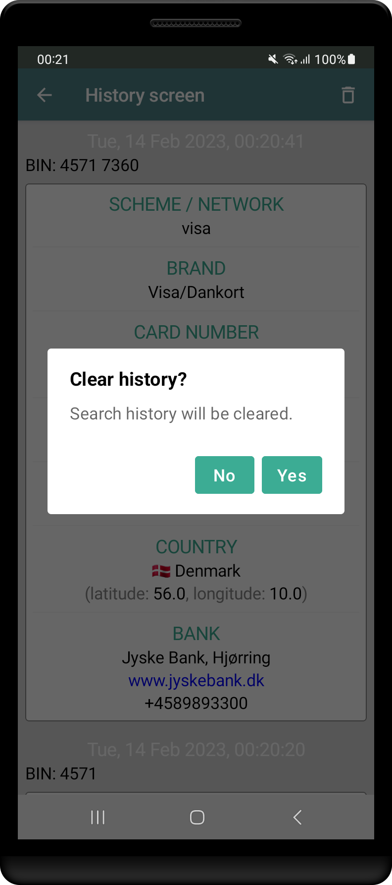

# CFTTestTask

The task is to create an application with functions:

1.The user enters the BIN of the bank card and sees all the available information about it, loaded from https://binlist.net/.

2.History of previous requests is shown in a list.

3.History of previous requests is not lost when restarting the application.

4.Clicking on the bank URL, bank phone number, country coordinates sends the user to application that can process this data (browser, phone, maps).

In project are used: MVVM, Jetpack Compose, Hilt, Retrofit, Room, Navigation, Coroutines.

 
